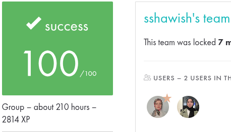

# 🐚 Minishell

> A miniature Unix shell developed as part of the [42 School](https://42.fr) curriculum.

---



---

## 📌 Project Description

**Minishell** is a custom-built shell that mimics the behavior of Bash. It parses user input, supports execution pipelines, manages redirections, and implements a set of built-in commands—entirely from scratch using system calls.

This project deepens your understanding of process management, parsing, and terminal behavior in a Unix environment.

---

## 🧠 Features

- ✅ Custom shell prompt
- ✅ Execution of external programs with arguments
- ✅ Built-in commands:
  - `echo`
  - `cd`
  - `pwd`
  - `export`
  - `unset`
  - `env`
  - `exit`
- ✅ Input/output redirections: `<`, `>`, `>>`
- ✅ Heredoc (`<<`)
- ✅ Pipes: `ls -l | grep minishell`
- ✅ Quoting: single `'` and double `"` quotes
- ✅ Environment variable expansion: `$USER`, `$HOME`, `$?`, etc.
- ✅ Signal handling: `Ctrl+C`, `Ctrl+\`, etc.
- ✅ Full memory cleanup (no leaks)

---

## 🛠️ Installation & Usage

### 🔧 Requirements

- Unix-like system (Linux/macOS)
- POSIX-compatible terminal
- `make`
- `cc` compiler (default system C compiler)

### 📥 Clone the Repository

```bash
git clone https://github.com/falhaimouni/minishell.git
cd minishell
make
./minishell

